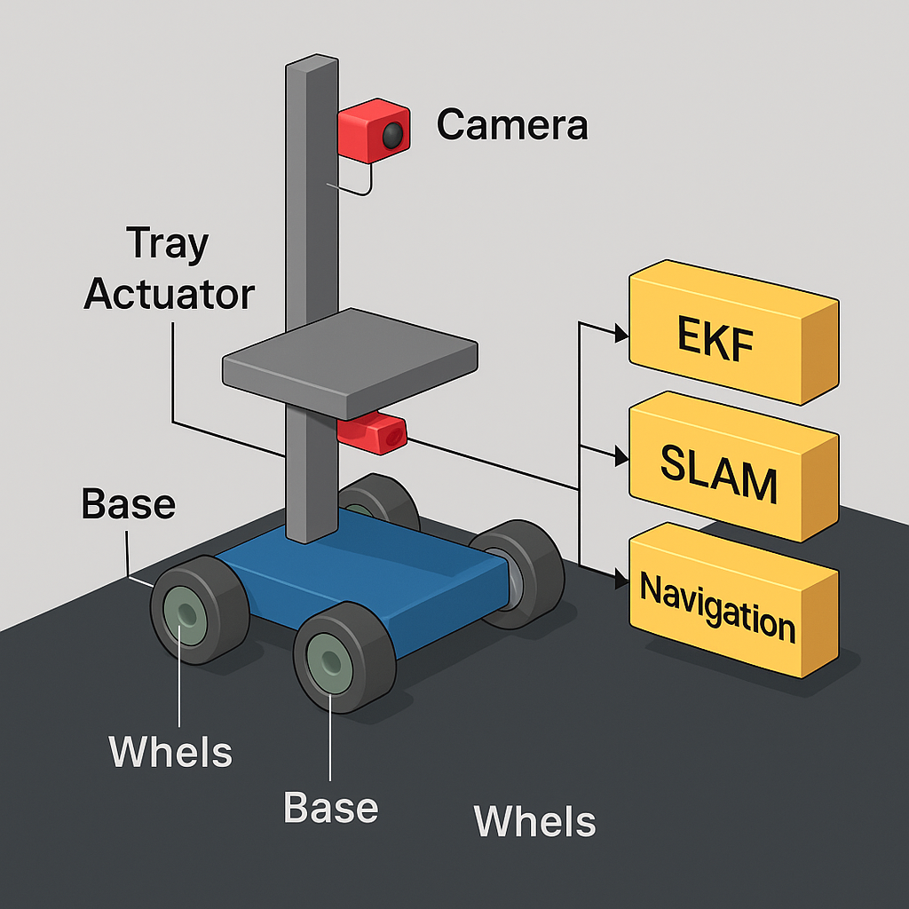

# Inventory-Bot
An autonomous inventory bot using ROS, SLAM, and obstacle avoidance to navigate warehouses. It features a Python-controlled adjustable tray, allowing the bot to deliver inventory to specific drawers or trays at various heights. The bot's design optimizes warehouse efficiency with minimal human intervention.
- Fully custom URDF with LiDAR, RGB camera, and prismatic tray control
- Includes realistic physics and sensor noise models for accurate simulation
- Integrated with gazebo_ros_control and publishes ROS topics for navigation and perception

## System Overview

🎥 **Demo Video (SLAM + Obstacle Avoidance):** [Watch here](https://drive.google.com/file/d/1bjBxYlOi41ZNOsOR_7jinCusTCw98ddR/view?usp=sharing)  

## Features
- LiDAR & Camera-based obstacle avoidance
- Extended Kalman Filter (EKF) for sensor fusion
- SLAM-based mapping and localization (e.g., GMapping/Cartographer)
- Custom tray actuation system using Python
- Real-time simulation in Gazebo and visualization in RViz
- Python scripts that enable the bot to navigate to target locations and set initial poses.

## Components

- **Base & Wheels**: The mobile platform for movement.
- **Tray Actuator**: Mechanism to lift or move the payload.
- **Camera**: Used for visual input (e.g., object detection, SLAM).
- **LiDAR**: Provides 360° environment scanning for mapping and obstacle avoidance.
- **ROS Nodes**:
  - `EKF`: Extended Kalman Filter for sensor fusion (IMU + wheel odometry + GPS/LiDAR).
  - `SLAM`: Simultaneous Localization and Mapping using camera and/or LiDAR data.
  - `Navigation`: ROS Navigation Stack for global and local path planning.

## Usage
### 1. Set Initial Position
To set the initial pose of the robot based on the current position from Gazebo, use:
python set_initial_pose.py
### 2. Set Target Position 
To move the robot to a specific target location, use:
python move_bot.py <x_position> <y_position>
### 3. Move Tray
To move the tray to a specific z-position, use the following command:
python move_tray.py <target_position>

## Installation 
### 1. Clone the Repository
git clone <repository_url>
### 2. Build the Package
cd <workspace>
catkin_make
### 3. Source the Workspace
source devel/setup.bash

## Requirements
- ROS (Robot Operating System)
- Python 2 or 3
- Gazebo (for simulation)

## Future Work:
- Develop a more complex robot model and integrate with multiple sensors
- Implement autonomous navigation using machine learning
